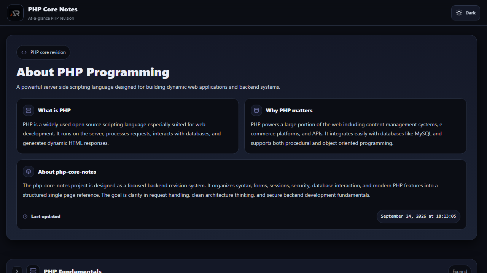

# PHP Core Notes

A focused React revision guide for PHP fundamentals, object-oriented programming, web development, security, databases, and practical backend concepts.



## Features

- Topic-based notes with readable explanations and examples.
- Dark and light themes with preference persistence.
- Fixed branded header with independent content scrolling.
- Responsive layout with a floating scroll-to-top control.
- Icon-only social and support links in the footer.

## Tech stack

React, Vite, styled-components, react-icons, and CSS custom properties.

## Run locally

```bash
npm install
npm run dev
```

Build and deploy:

```bash
npm run lint
npm run build
npm run deploy
```

Live URL: [a2rp.github.io/php-core-notes](https://a2rp.github.io/php-core-notes/)

## Links

- [Portfolio](https://www.ashishranjan.net/)
- [GitHub](https://github.com/a2rp)
- [CodePen](https://codepen.io/ash1198)
- [LinkedIn](https://www.linkedin.com/in/aashishranjan)
- [Facebook](https://www.facebook.com/theash.ashish/)
- [YouTube](https://www.youtube.com/@ashishranjan-ashz?sub_confirmation=1)

## Support

- [Support](https://a2rp-donation-page.netlify.app/)
- [Buy Me a Coffee](https://buymeacoffee.com/a2rp)
- [Patreon](https://patreon.com/a2rp)
