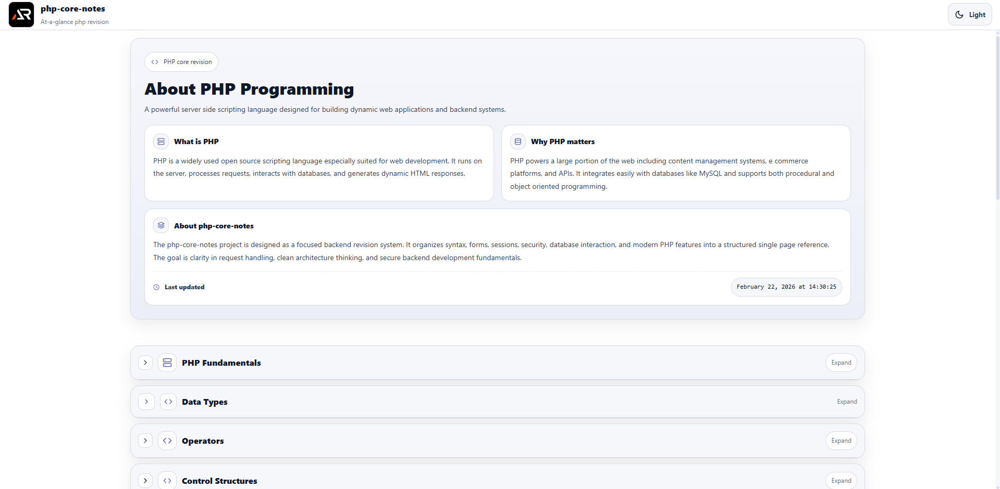

# PHP Core Notes

A single-page, at-a-glance revision project for core PHP programming concepts.

This project is designed as a fast reference and structured summary sheet covering essential PHP topics without unnecessary depth.  
It focuses on clarity, backend fundamentals, forms and sessions, database basics, security essentials, and practical modern PHP for beginners and interview revision.

---



---

## Purpose

- Quick revision before interviews
- Rapid recall of PHP syntax and server-side concepts
- Clear mental model of request-response flow and backend fundamentals
- Practical reminders for building safe, real-world PHP apps
- Strong foundation for CRUD apps, APIs, and moving to frameworks later

## Coverage

- PHP fundamentals and execution flow
- Syntax, variables, constants, and data types
- Operators and expressions
- Control flow - if else switch loops break continue
- Arrays - indexed, associative, multidimensional and common functions
- Strings and common string functions
- Functions - parameters, return, scope, anonymous and arrow functions
- Superglobals - GET POST REQUEST SERVER FILES SESSION COOKIE
- Forms handling - validation and sanitization
- Sessions and cookies - login basics
- File handling - read write uploads
- Error handling - errors, exceptions, try catch throw
- PHP with HTML - embedding, basic templating and structure
- OOP in PHP - classes, objects, access modifiers, inheritance, interfaces, traits
- Namespaces and autoloading basics
- Database basics - MySQL with PDO or mysqli, CRUD
- Prepared statements and SQL injection prevention
- Password hashing - password_hash and password_verify
- Security essentials - XSS, CSRF basics, safe output, secure uploads
- JSON and APIs - json_encode, json_decode, headers, REST basics
- Modern PHP features - typed properties, strict types, null coalescing, match
- Composer basics - packages and autoloading
- Common pitfalls and best practices

## Tech Stack

- React
- Vite
- styled-components

## Project Type

Single page only  
Section-based navigation  
Searchable and expandable content  
No blog-style content, only structured notes

Each topic is modular and collapsible for fast scanning.

## Run Locally

```bash
npm install
npm run dev
```

### Goal

Complete core PHP knowledge in one scrollable page.
No fluff. No repetition. Just essentials.

## Links

- Portfolio: [https://www.ashishranjan.net](https://www.ashishranjan.net)
- GitHub: [https://github.com/a2rp](https://github.com/a2rp)
- CodePen: [https://codepen.io/ash1198](https://codepen.io/ash1198)
- LinkedIn: [https://www.linkedin.com/in/aashishranjan](https://www.linkedin.com/in/aashishranjan)
- Facebook: [https://www.facebook.com/theash.ashish/](https://www.facebook.com/theash.ashish/)
- YouTube: [https://www.youtube.com/@ashishranjan-ashz?sub_confirmation=1](https://www.youtube.com/@ashishranjan-ashz?sub_confirmation=1)
- Email: [ash.ranjan09@gmail.com](mailto:ash.ranjan09@gmail.com)

## Support

- Support: [https://a2rp-donation-page.netlify.app/](https://a2rp-donation-page.netlify.app/)
- Buy Me A Coffee: [https://buymeacoffee.com/a2rp](https://buymeacoffee.com/a2rp)
- Patreon: [https://patreon.com/a2rp](https://patreon.com/a2rp)
<!-- Project links -->

## Links

- Live: [https://a2rp.github.io/php-core-notes/](https://a2rp.github.io/php-core-notes/)
- Repository: [https://github.com/a2rp/php-core-notes](https://github.com/a2rp/php-core-notes)
- Portfolio: [https://www.ashishranjan.net/](https://www.ashishranjan.net/)
- GitHub: [https://github.com/a2rp](https://github.com/a2rp)
- CodePen: [https://codepen.io/ash1198](https://codepen.io/ash1198)
- LinkedIn: [https://www.linkedin.com/in/aashishranjan](https://www.linkedin.com/in/aashishranjan)
- Facebook: [https://www.facebook.com/theash.ashish/](https://www.facebook.com/theash.ashish/)
- YouTube: [https://www.youtube.com/@ashishranjan-ashz?sub_confirmation=1](https://www.youtube.com/@ashishranjan-ashz?sub_confirmation=1)
- Email: [ash.ranjan09@gmail.com](mailto:ash.ranjan09@gmail.com)

## Support

- Support: [https://a2rp-donation-page.netlify.app/](https://a2rp-donation-page.netlify.app/)
- Buy Me a Coffee: [https://buymeacoffee.com/a2rp](https://buymeacoffee.com/a2rp)
- Patreon: [https://www.patreon.com/a2rp](https://www.patreon.com/a2rp)
